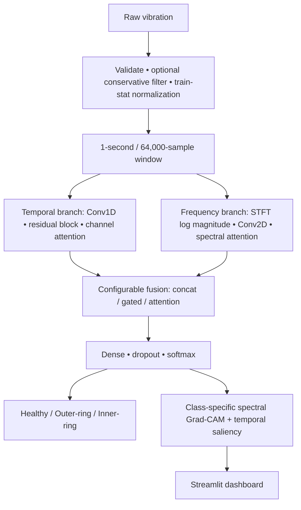

# SentinelAI

SentinelAI is an experimental, three-class classifier for the Paderborn University Bearing Dataset (`vibration_1`, nominal 64 kHz): healthy (0), real outer-ring damage (1), and real inner-ring damage (2). It is a laboratory benchmark, not a deployed predictive-maintenance system.

## Architecture



The temporal branch detects transient/shape information; STFT preserves when frequency content occurs, unlike one global FFT. Lightweight attention recalibrates informative channels. Fusion learns whether temporal or spectral evidence should dominate each embedding.

Legacy baseline, temporal-only, frequency-only, original fused SentinelAI, MSRF, and MSRF-v2 models remain in `src/models.py`. The new compact `ImprovedSentinelAI` is in `src/improved_model.py` (~25K trainable parameters with the default configuration), so comparisons do not silently change historical models.

## Data integrity and preprocessing

The manifest fixes bearing-level splits before windowing. Every `build_datasets()` call validates that train, validation, and test bearing sets are disjoint, verifies the fixed class map, and raises on overlap. Current manifest report:

| Split | Bearings | Windows (healthy / outer / inner) |
|---|---|---:|
| Train | K001–K004, KA04, KA16, KA30, KI04, KI16, KI18 | 3,191 (1,278 / 957 / 956) |
| Validation | K005, KA15, KI21 | 955 (320 / 317 / 318) |
| Test (locked) | K006, KA22, KI14 | 955 (320 / 315 / 320) |

Default preprocessing is the established 1-second, no-overlap, raw-signal pipeline with global Z-score statistics derived only from 3,191 training windows. Filtering is disabled by default. Enabling it requires regenerated filtered training statistics; the loader refuses an unsafe raw-stat/filter mismatch.

## Commands

```bash
python -m pip install -r requirements.txt
python -m src.diagnostics
python -m pytest -q

# End-to-end smoke train: uses only small train/validation subsets; no test data
python -m src.upgrade_experiments --epochs 1 --max-windows 32 --output-dir results/smoke/improved_sentinelai

# Full validation-only compact-model fusion ablation (select by validation Macro-F1)
python -m src.upgrade_experiments

# Explicitly evaluate the validation-selected compact model once on the locked test set
python -m src.upgrade_experiments --final-test

# Existing historical controlled comparison
python -m src.experiments

streamlit run app/app.py
```

Each compact-model run saves its configuration, split report, normalization values, checkpoint(s), and a summary in its experiment directory. The training loop saves the validation-best checkpoint and supports normal or training-label-only class-weighted cross entropy through `model.use_class_weights`.

## Existing verified results and limitation

These are historical experiments, not claims for the new compact architecture:

| Model | Validation Macro-F1 | Test Macro-F1 | Test accuracy |
|---|---:|---:|---:|
| Baseline 1-D CNN | 0.5558 | 0.5567 | 0.6702 |
| Temporal-only | 0.5558 | 0.5567 | 0.6702 |
| Frequency-only (selected by validation) | 0.6152 | 0.6641 | 0.6743 |
| Original SentinelAI | 0.5558 | 0.8211 | 0.8335 |
| MSRF-v2 | 0.3581 | not evaluated | — |

The original SentinelAI's high post-selection test result was not selected because its validation result was poor. The diagnostic audit found no label, normalization, checkpoint, DataLoader, BatchNorm, or Dropout defect. Its validation failure is consistent with bearing/domain shift: KA15 is a low-energy plastic outer-ring case unlike several high-energy training outer-ring fatigue cases and has statistics similar to the held-out inner bearing KI21. Consequently, the improved model is not claimed to outperform any baseline until the validation-first run completes.

Known limitations: limited bearing identities, laboratory operating conditions, three-class formulation, domain shift, no calibration, and no production/edge deployment validation. Grad-CAM and gradient saliency show model sensitivity, not causal mechanical proof.
